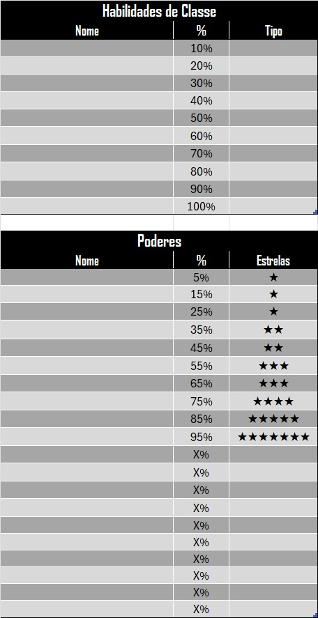

## Downloading the Character Sheet

First of all, you need to know what character sheet you need to your campaing. The last one version (4.2.) it's the most recent, where you can find in [README](README.md/#42). After choosing a sheet, you need to download by clicking in the Download link and instead using a command `Ctrl` `Shift` `S` in your keyboard. You can do it manually too, just using your mouse to click in the three points in the right top button, below your accout image and choosing the "Download" option. 

After download the character sheet you need to open and hability all the "macros" and "edit". 

Now you have you character sheet ready to use. You can finish reading this document for more explanations. 

---

## Recommendations

Feel free to modify the sheet as you wish, but be careful with the Excel formulas and macros. You’ll notice that some cells have a gray background — this indicates a **FORMULA CEIL**. If you change anything in these cells, it may cause errors, so proceed with caution. If you need any assistance, feel free to contact me.

---

## Basic Characteristics

The first thing to do is write the basic characteristics of your character. In this part of sheet you will fill the cell with your character's name, age, rank, date of birth, local of birth, background (you need to check the STARS's book), class, trail and Chaotic Exposure.

  

---

## Attributes and Health

To the right of the [Basic Characteristics](#basic-characteristics), you can distribute your attribute points. Regarding the limits, you need to consult your Tabletop Master. On the same topic, you can view your HP, PP, and SP points automatically calculated. In the last line, you have your PP Limit calculated.

  

---

## Class abilities and Powers

Below the [Basic Characteristics](#basic-characteristics), you can find two tables. In these tables, you can fill the name of the ability you are taking and the Powers that you have created. You can describe everthing your abilities do in the annotations in Excel.

  

---

## Expertises

The last table in the extreme right of the sheet is Expertise Table what calculates you expertise modifications. You only need to select what level of training is you character with this Expertise and write the modifications of a expertise on "Others" column (penultimate).

  

---

## Resistence and Damage Reduction

First of all, you need to select what type of damage you receive. After this, if you have any damage division you need to select "SIM" to half the damage.

  

--- 
