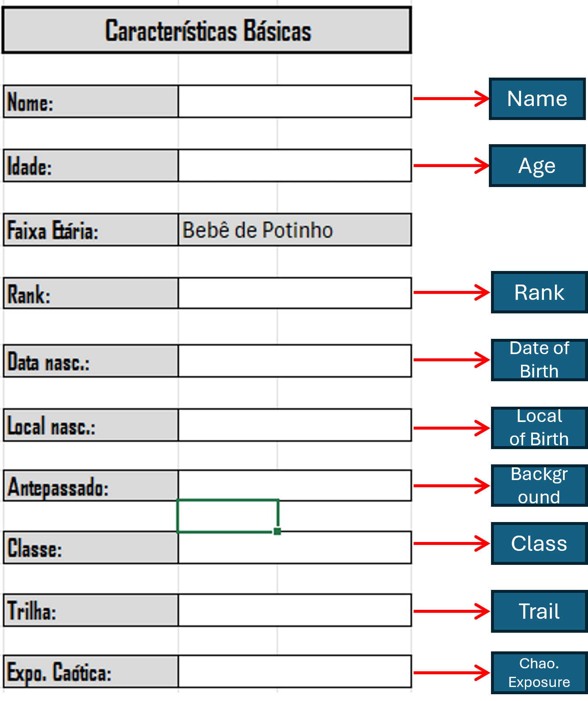

## Downloading the Character Sheet

First of all, you need to know what character sheet you need to your campaing. The last one version (4.2.) it's the most recent, where you can find in [README](README.md/#42). After choosing a sheet, you need to download by clicking in the Download link and instead using a command `Ctrl` `Shift` `S` in your keyboard. You can do it manually too, just using your mouse to click in the three points in the right top button, below your accout image and choosing the "Download" option. 

After download the character sheet you need to open and hability all the "macros" and "edit". 

Now you have you character sheet ready to use. You can finish reading this document for more explanations. 

---

## Recommendations

Feel free to change the sheet as your wish, but be careful with the Excel fórmulas and macros. You will see that some cells has the background gray, this a signal to **NOT CHANGE THE CEIL**. If you want any help, contact me.

---

## Basic Characteristics

The first thing to do is write the basic characteristics of your character. In this part of sheet you will fill the cell with your character's name, age, rank, date of birth, local of birth, background (you need to check the STARS's book), class, trail and Chaotic Exposure.

  

---

## Attributes and Health

To the right of the [Basic Characteristics](#basic-characteristics) you can distribute your attibute points. Regarding the limits, you need to consult you Tabletop Master.

  

---

## Class abilities and Powers

Below the [Basic Characteristics](#basic-characteristics), you can find two tables. In these tables, you can fill the name of the ability you are taking and the Powers that you have created. You can describe everthing your abilities do in the annotations in Excel.

  

---